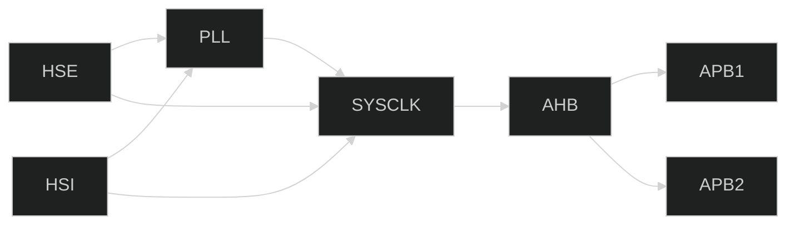

# F3 HW note

```mermaid
%%{init:{'theme':'dark'}}%%
graph LR
  HSE    --> PLL
  HSI    --> PLL
  HSI    --> SYSCLK
  HSE    --> SYSCLK
  PLL    --> SYSCLK
  SYSCLK --> AHB
  AHB    --> APB1
  AHB    --> APB2
```